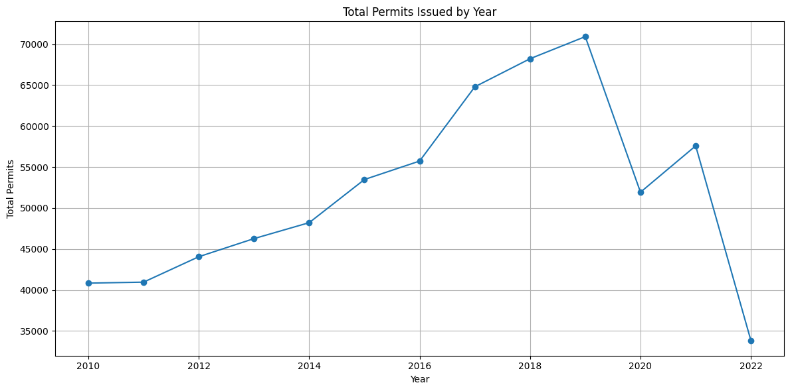
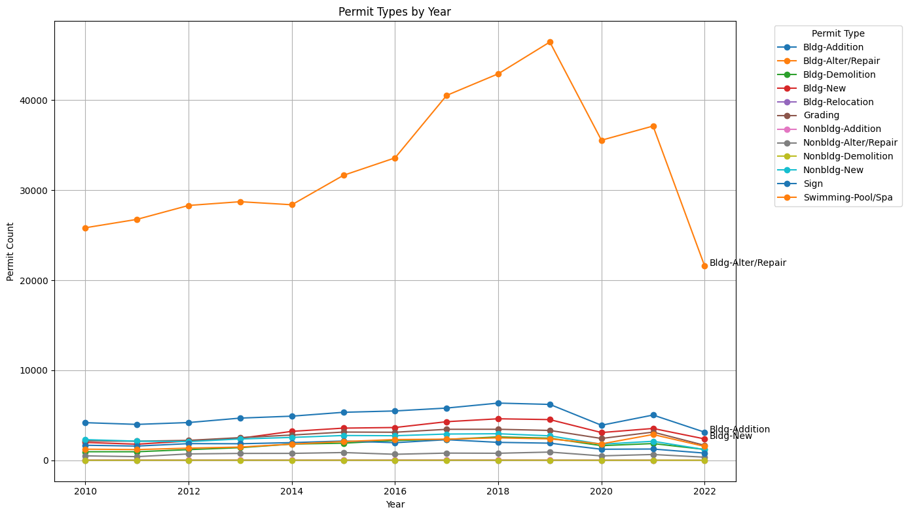
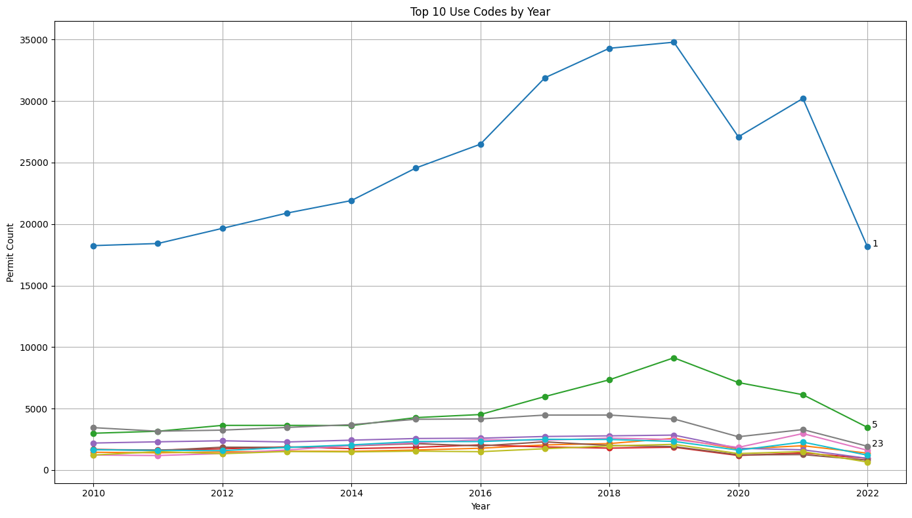
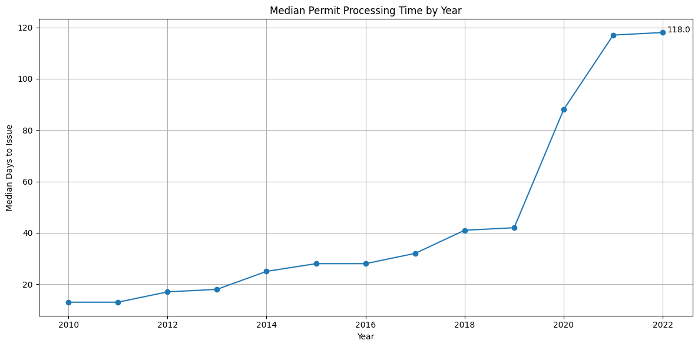
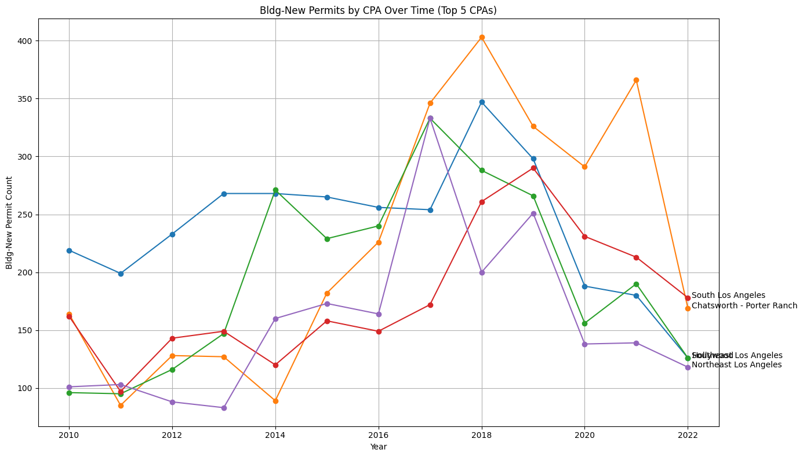
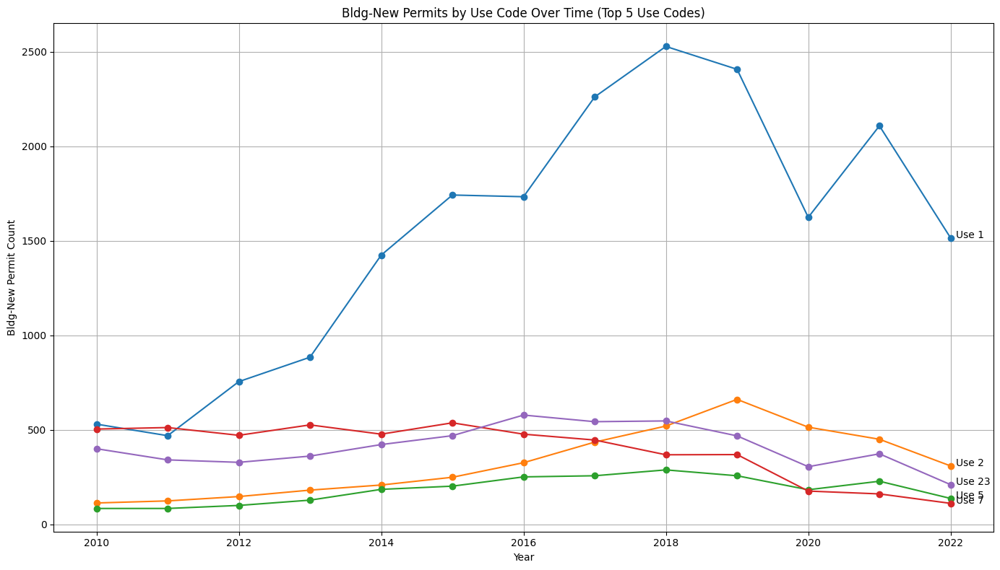
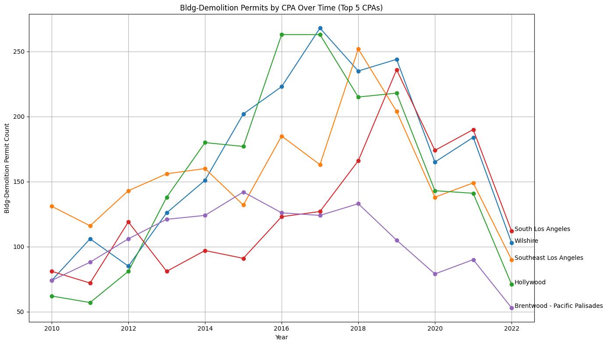
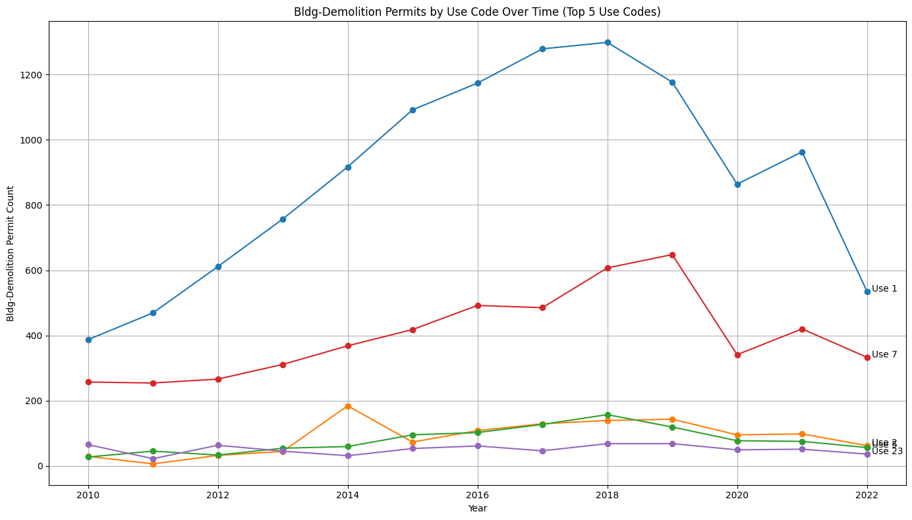
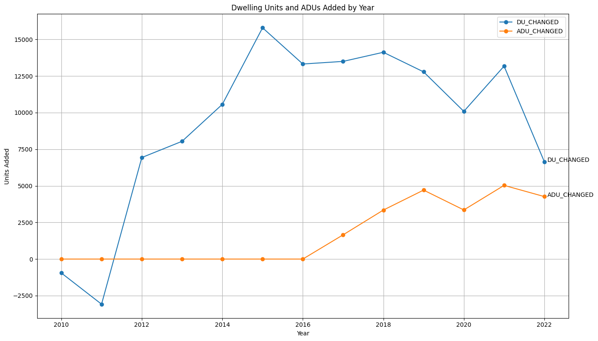
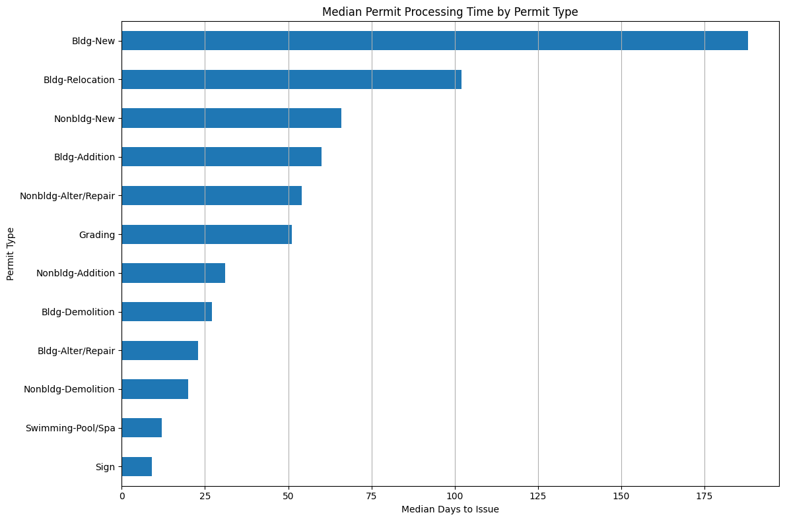

# la-developments
Case study visualizing and analyzing a permits dataset to assess development trends in LA City.

## Summary and key takeaways
- Between January 2010 and August 2022, 676,829 building and safety permits were issued by the City of Los Angeles.

- There was a steady increase in permits issued between 2010 and 2019, but the number of permits issued dropped dramatically between 2019 and 2020 from a peak of 70,917 in 2019 to 51,935 in 2020.

- Examining permits by type, building alterations and repairs were by far the most commonly issued permits during the study period, followed by building additions and new buildings.

- Using the USE_CODE associated with each permit, Use Code 1 (Single-Family Dwelling) accounted for the largest share of permitted structures. Use Code 5 (Apartment) made a steady rise through the 2010s, especially between 2016 and 2019, but declinined like most other Use Codes since 2019.

- The Hollywood CPA received the most permits in the analysis period with 51,597, followed by the Wilshire CPA with 45,233 permits issued. However, if we focus on new building permits, then Southeast Los Angeles led the way over this period with 3,101, followed by Chatsworth - Porter Ranch at 2933. From 2010-2022, 41,208 permits for new buildings were issued citywide.
- Wilshire was the leading CPA in terms of building demolition permits issued at 2,166. Southeast Los Angeles had the 2nd most demolitions with 2,019. From 2010-2022, 22,471 permits for building demolitions were issued citywide.
- In terms of housing production, permits were issued for a net 120,391 dwelling units and 22,360 ADUs citywide. There were three areas of concentration for additional dwelling units: Central City (Downtown), Wilshire, and Hollywood. The San Fernando Valley also saw high concentrations of newly permitted ADUs, led by the Reseda–West Van Nuys and Canoga Park–Winnetka–Woodland Hills–West Hills CPAs.
- The median time between a permit being submitted and a permit being issued was 40 days. Over time, the processing period increased steadily, starting from a median 13 days in 2010, to a median 118 days in 2022.

## New developments, 2010-2022

- New building development was concentrated in several areas, particularly the western and southern portions of the San Fernando Valley and the eastern parts of Los Angeles. There was a noticeable lack of new building permits in Downtown Los Angeles. In Central City (downtown) and Central City North, building alterations and repairs made up the bulk of permits issued by a large margin.

- Over the period as a whole, Southeast Los Angeles (blue line) was issued the most permits for new buildings. However, Chatsworth–Porter Ranch, located on the northwestern edge of the San Fernando Valley, experienced a sharp increase in new building activity during the latter half of the 2010s. Peaks in new building production for these leading CPAs are generally around 2017-2019, and declining rather consistently since then.

- The types of new buildings being permitted for construction are most commonly single family dwellings (Use Code 1). The number of single family dwellings being constructed grew rapidly from 2011-2018. DDuplexes (Use Code 2) also experienced a significant increase in construction activity during the 2010s. Construction of multifamily apartments (Use Code 5) remained relatively low throughout the study period, a finding that warrants further investigation given policy goals related to increasing housing density.

## Loss of development, 2010-2022

- The southern San Fernando valley and most of "central" Los Angeles were the most concentrated zones of building demolition in the analysis period. In the previous section, we noted that Chatsworth - Porter Ranch was one of the zones with the most new buildings, along with South East Los Angeles. Notably, Chatsworth–Porter Ranch experienced substantial new construction with relatively few demolitions, while Southeast Los Angeles exhibited high concentrations of both new construction and demolitions.

- Four relatively dense CPAs accounted for the highest number of building demolitions during the study period. The demolitions generally peaked around 2017-2019, and this peak is identical to the new building peak mentioned earlier.

- Like the new buildings, the demolished buildings also were highest for single-family dwellings (Use Code 1). One thing to note is the high number of parking lots demolished (Use Code 7). However, there were still significant numbers of parking lots being built at those same times. Only in 2016 did the number of parking lots being demolished begin to outnumber the number being built which is a trend that continued throughout the rest of the decade.

## Housing and permitting

- The number of dwelling units permitted citywide increased through 2015, when more than 15,000 units were added, before declining steadily thereafter. Additionally, ADUs saw growth from 2016-2019, but have not declined like most other types of permits. Instead, ADU permitting has largely plateaued.

- In terms of processing time (measured as the number of days between permit submission and issuance), new building permits had the longest median review period, exceeding six months. On the contrary, the type of permit that was issued the most, building alterations and repairs, saw one of the shorter median processing times at less than a month. While many factors contribute to these differences, the permitting process for new construction is frequently cited by developers as a barrier to housing production and investment in Los Angeles.

## Methodology

New development was defined as permits categorized as "New Building" and mapped using permit locations. Permit counts were aggregated by Community Plan Area (CPA) to identify areas with the highest concentrations of new construction activity.

Loss of development was defined as permits categorized as "Building Demolition." Demolition permits were similarly aggregated by CPA and mapped to identify areas experiencing the greatest levels of building removal.

Additional analyses examined permit type, structure use code, dwelling units, accessory dwelling units (ADUs), and permit processing times between 2010 and 2022.

The permit dataset was first processed and analyzed in Python using Pandas and GeoPandas. Data cleaning, aggregation, temporal analysis, and summary statistics were performed to examine permit activity by year, permit type, USE_CODE, dwelling unit changes, ADUs, and processing times. Permit records were then spatially joined to Community Plan Area (CPA) boundaries in QGIS using their geographic coordinates, allowing permit activity to be aggregated and mapped by planning area. Final maps were produced in QGIS, while charts and visualizations were created in Python using Matplotlib.

## Conclusions and future research

Development activity in Los Angeles increased steadily throughout the 2010s before declining after 2019. New construction was concentrated in a limited number of Community Plan Areas, while demolition activity often occurred in the same locations, suggesting ongoing redevelopment. Housing production was driven primarily by single-family development, and permit processing times increased substantially over the study period.

Future research could investigate the factors that influence development activity, including interest rates, construction costs, labor availability, housing market conditions, zoning regulations, and access to public transportation, to better understand the drivers of new construction and demolition across Los Angeles.

Future research could also examine how development patterns affect and respond to broader economic and demographic trends, including employment in major industries such as entertainment, population growth and decline, migration patterns, housing affordability, and population aging, to better understand the long-term relationship between urban development and regional change.
